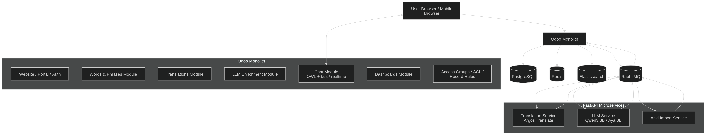
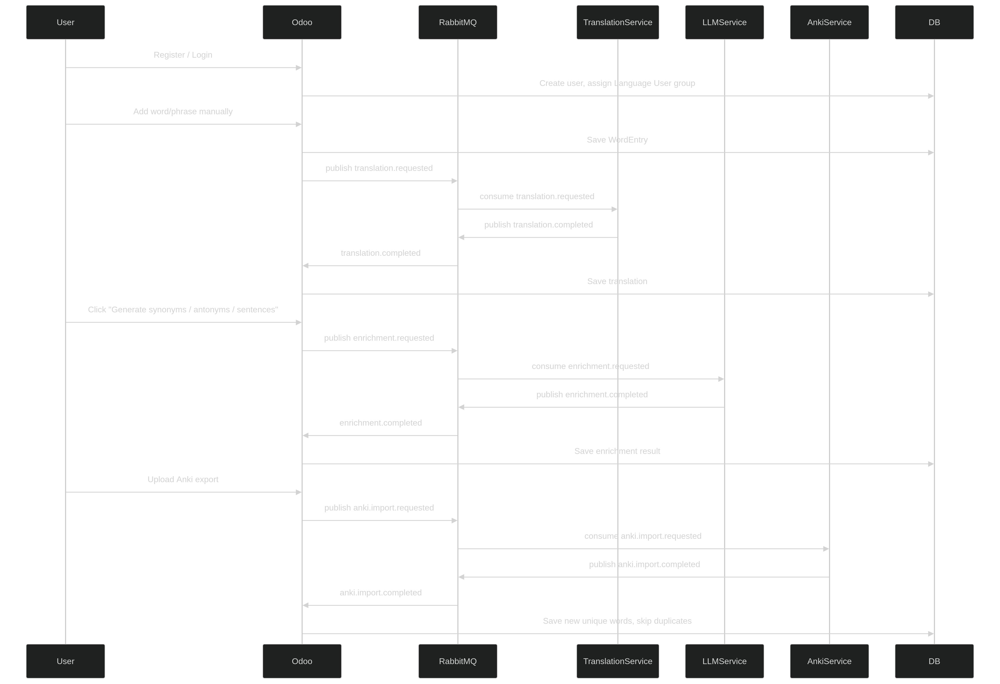
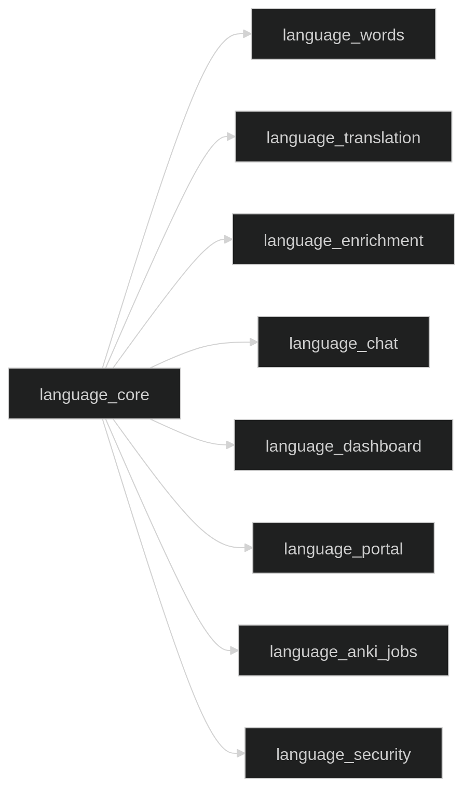
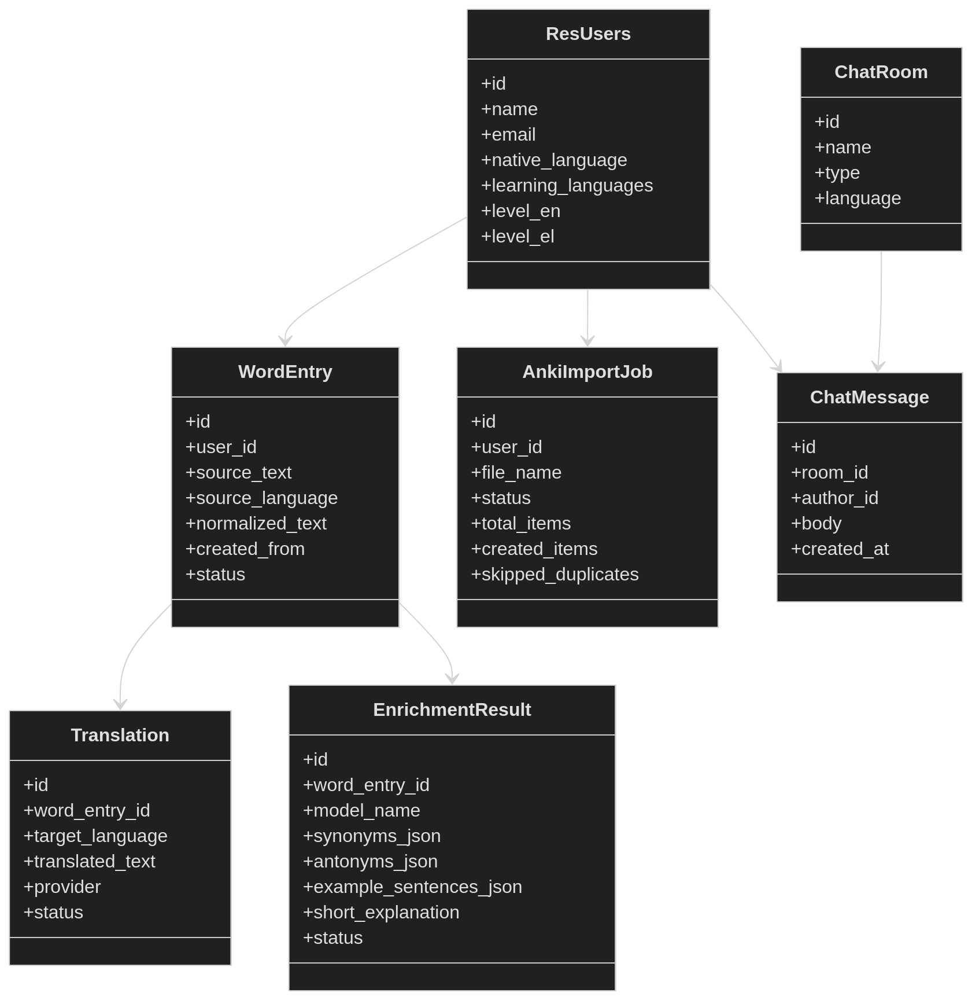
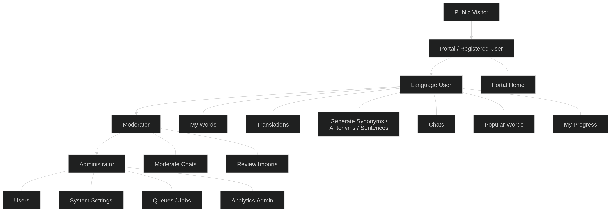

# Lexora

## Overview

This MVP is a language-learning platform for **English, Greek, and Ukrainian**.

The product uses:

- **Odoo monolith** as the main product platform
- **FastAPI Translation Service** for simple offline translation
- **FastAPI LLM Service** for synonyms, antonyms, example sentences, and short explanations
- **FastAPI Anki Import Service** for importing Anki exports
- **RabbitMQ** for async integration between Odoo and microservices
- **PostgreSQL** for business data
- **Redis** for cache / realtime support
- **Elasticsearch** for dashboards, analytics, and trending words

For MVP, we **do not support image upload / OCR yet**.

## General architectural diagram

---

## Goals of the MVP

The system should allow a user to:

- register and log in
- manually add a word or phrase
- import words from Anki export
- automatically skip duplicates
- translate words or phrases between **English, Greek, and Ukrainian**
- request generation of:
  - synonyms
  - antonyms
  - example sentences
  - short explanation
- chat with other users to practice writing
- see dashboards such as:
  - popular words
  - personal activity
  - language usage
  - most translated words
  - most enriched words

## User script logic

---

## Main Architecture

### Main idea

- **Odoo** is the central system:
  - website / portal
  - auth
  - users
  - roles
  - words and phrases
  - translations
  - generated enrichment
  - chats
  - dashboards
  - admin/backoffice
- **Translation Service** performs simple offline translation via a free Python library
- **LLM Service** uses a local free model up to **20 GB**
- **Anki Import Service** parses exports and skips duplicates
- **RabbitMQ** connects everything asynchronously

---

## Recommended Models and Services for MVP

### Translation service
Recommended offline approach:
- **Argos Translate**

### LLM service
Recommended local free model:
- **Qwen3 8B**

Possible alternative if Greek support becomes more important:
- **Aya Expanse 8B**

### Search / analytics
- **Elasticsearch**

### Realtime / auxiliary
- **Redis**

---

## General Architecture Diagram

## Breakdown of modules within Odoo

---

## Which entities to keep in Odoo

---

## Access and Roles Diagram in Odoo

